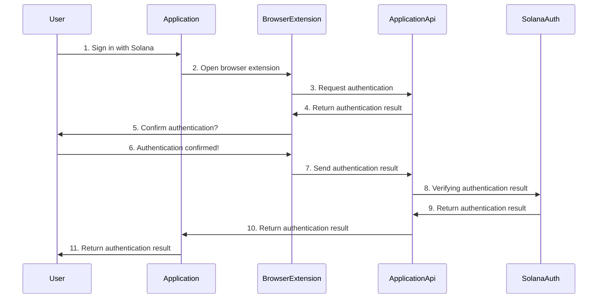

# Solana Auth Specification

Welcome to the Solana Auth Specification repository. This document serves as the base working document to sketch out
what we want to build before starting development.

## Table of Contents

1. [Introduction](#introduction)
2. [Scope](#scope)
3. [Features](#features)
4. [Authentication Flow](#authentication-flow)
5. [SDK](#sdk)
6. [TODO](#todo)
7. [Contributing](#contributing)

## Introduction

Solana Auth aims to provide a robust, open-source authentication solution with first-party support for Solana. This
specification outlines the core features for the first iteration of the Solana Auth library.

The goal is to provide an easy-to-use, secure, and flexible package that can be integrated into any application or
service that requires users to authenticate with their Solana wallets.

At this point in time we will focus on formalizing existing best practices and standards instead of creating a new
authentication protocol from scratch.

## Scope

The scope of this specification is limited to verifying the ownership of a Solana identity by signing a message or
transaction.

This specification does not cover:

- Handling JWT tokens, cookies, or other authentication tokens.
- Handling sessions.
- Handling OAuth tokens.

While these are important topics and needed for a robust authentication solution, they are out of scope for this
specification. They might be added in the future if there is a need for them or we see patterns emerge.

## Features

### 1. Sign in with Solana

Authenticate users using [SIWS](https://github.com/phantom/sign-in-with-solana), currently supported
by the browser extensions [Backpack](https://backpack.app)
and [Phantom](https://phantom.com/).

**Example Use Case:** A web application that requires users to authenticate using their Solana wallets.

### 2. Sign in by Signing a Message

Authenticate users by signing a message using their Solana wallet. This method is suitable for browser extensions that
don't support SIWS (like [Solflare](https://solflare.com/) and others). It is also suitable for command-line
applications and scripts, APIs or AI agents that require a secure way to verify
their identity.

**Example Use Case:** A command-line tool that needs to authenticate users securely.

### 3. Sign in by Signing a Transaction

Authenticate users by signing a transaction using their Solana wallet. This method is suitable for browser extensions in
combination with a Ledger wallet. In this flow, the transaction is signed but not sent to the network.

**Example Use Case:** A web application that uses Ledger wallets for secure transactions.

### 4. Sign in by Signing an Offchain Message

Authenticate users by [signing an offchain message](https://docs.anza.xyz/cli/examples/sign-offchain-message) using the
Solana cli.

**Example Use Case:** A script that needs to authenticate users offchain, without relying on a browser extension.

## Authentication Flow

The authentication flow is very similar for all methods. The flow is as follows:

1. The user:
    1. Initiates the authentication flow.
    2. Provides their Solana public key.
    3. Sends this to the application API.
2. The application:
    1. Creates a verification message using the public key.
    2. Sends the verification message to user.
3. The user:
    1. Signs the verification message.
    2. Sends the signed message to the application API.
4. The application API:
    1. Verifies the signed message.
    2. Returns the authentication result.
5. The user:
    1. Has now verified that they can sign messages with the provided public key.

## SDK

This section will outline the SDK for the Solana Auth library.

### SDK configuration and instantiation

The SDK is configured using the `SolanaAuthConfig` object.

```typescript

export type SolanaAuthMethod =
    'solana:signIn'
    | 'solana:signMessage'
    | 'solana:signTransaction'
    | 'solana:signOffline'

export interface SolanaAuthConfig {
    // The methods that the instance will support.
    methods: SolanaAuthMethod[]
}

function createSolanaAuth(config: SolanaAuthConfig): SolanaAuthInstance {
    // Create the instance.
}

// Example usage.
const config: SolanaAuthConfig = {
    // Inidicates the methods that the instance will support.
    methods: [
        'solana:signIn',
        'solana:signMessage',
        'solana:signTransaction',
        'solana:signOffline'
    ],
}

// With the object, we can create an instance of SolanaAuth.
const solanaAuth: SolanaAuthInstance = createSolanaAuth(config)

// We use a plugin system to add support for different ways to connect to Solana.

// For example, we can use it with the new @solana/web3.js v2.
const solanaAuthSolanaRpc = createSolanaAuthSolanaRpc()
solanaAuth.use(solanaAuthSolanaRpc)

// For example, we can use it with Umi from Metaplex.
const solanaAuthUmi = createSolanaAuthUmi()
solanaAuth.use(solanaAuthUmi)

// Or leverate the Umi integration to work with the old 'Connection' object from @solana/web3.js v1.
const rpc = new Connection('endpoint')
solanaAuth.use({rpc})

// On the backend
const message = await solanaAuth.createVerificationMessage({
    method: 'solana:signIn',
    publicKey: 'xxxxxxxxxxxxxxxxxxxxxxxxxxxxxxxxxxxxxxxxxxx',
    // more properties
})

// On the frontend
const signature = await solanaAuth.signMessage({
    method: 'solana:signIn',
    publicKey: 'xxxxxxxxxxxxxxxxxxxxxxxxxxxxxxxxxxxxxxxxxxx',
    message,
    // more properties
})

// On the backend
const verified = await solanaAuth.verifySignedMessage({
    method: 'solana:signIn',
    publicKey: 'xxxxxxxxxxxxxxxxxxxxxxxxxxxxxxxxxxxxxxxxxxx',
    message,
    signature,
})

```

### 1. Sign in with Solana

### Authentication Flow



### Methods

```typescript
// TBD
```

### 2. Sign in by Signing a Message

```mermaid
sequenceDiagram
    participant User
    participant Application
    participant BrowserExtension
    participant ApplicationApi
    participant SolanaAuth
    User ->> Application: 1. Sign in by signing a message
    Application ->> BrowserExtension: 2. Open browser extension
    BrowserExtension ->> ApplicationApi: 3. Request authentication
    ApplicationApi ->> BrowserExtension: 4. Return authentication result
    BrowserExtension ->> User: 5. Sign this message?
    User ->> BrowserExtension: 6. Message signed!
    BrowserExtension ->> ApplicationApi: 7. Send signed message
    ApplicationApi ->> SolanaAuth: 8. Verifying signed message
    SolanaAuth ->> ApplicationApi: 9. Return authentication result
    ApplicationApi ->> Application: 10. Return authentication result
    Application ->> User: 11. Return authentication result
  ```

### 3. Sign in by Signing a Transaction

```typescript
// TBD
```

### 4. Sign in by Signing an Offchain Message

```typescript
// TBD
```

## TODO

This list is not exhaustive and is subject to change.

- [ ] Create specification.
    - [x] Setup repository and basic document structure.
    - [x] Specify features.
    - [ ] Specify API for the SDK based on the features.
- [ ] Create prototype to verify the specification.
    - [ ] Quick and dirty prototype of the library.
    - [ ] Example application that consumes the library.
- [ ] Spec out initial implementation.
    - [ ] Create detailed specification for the library, test, docs and examples.
    - [ ] Implement the library according to the specification.
    - [ ] Create the demo applications.
    - [ ] Write documentation.

## Contributing

### How to Contribute

- Get in tough with us on [Telegram](https://t.me/solana_auth) or [X](https://x.com/SolanaAuth) to discuss your ideas.
- Use pull requests (PRs) to propose changes to this spec.

---

This document is a work in progress. Please feel free to open pull requests (PRs) to propose changes and improvements.
